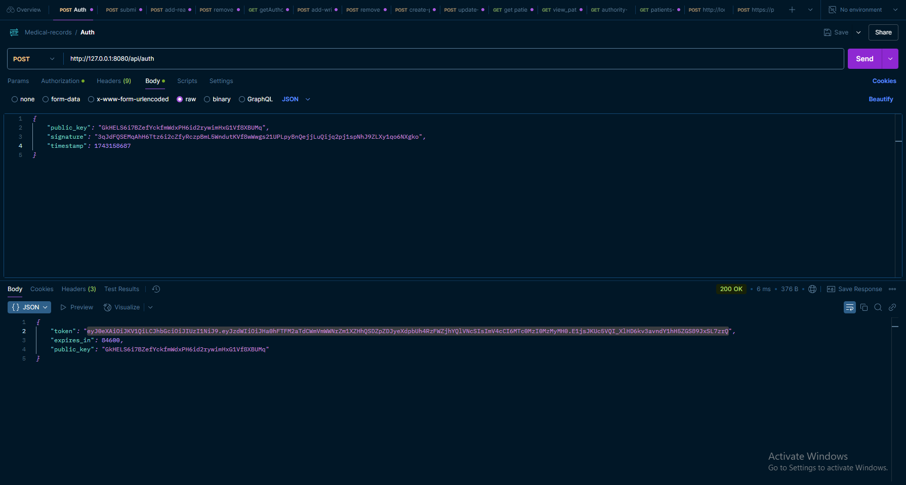
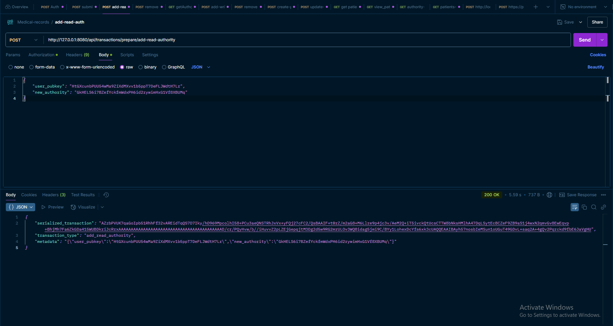
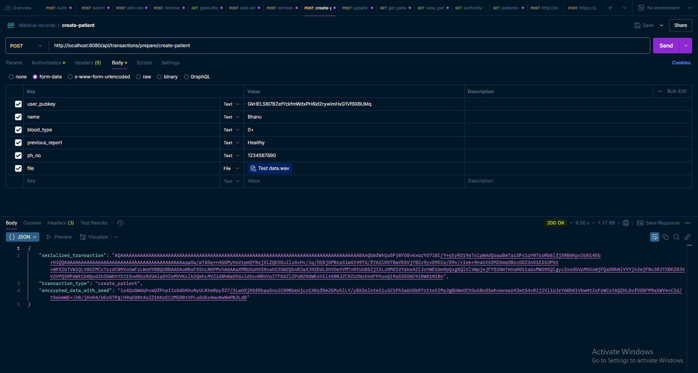
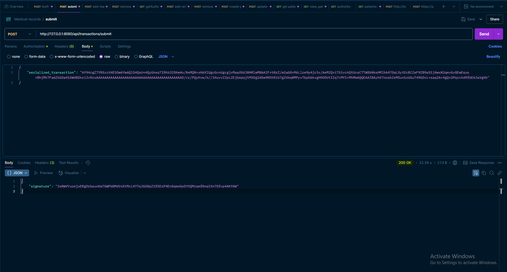
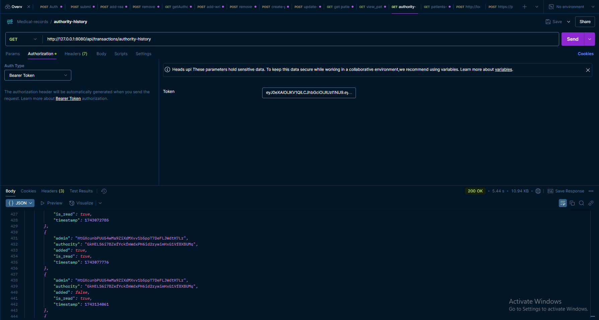
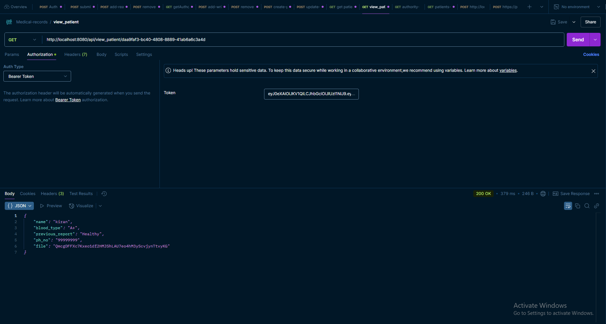
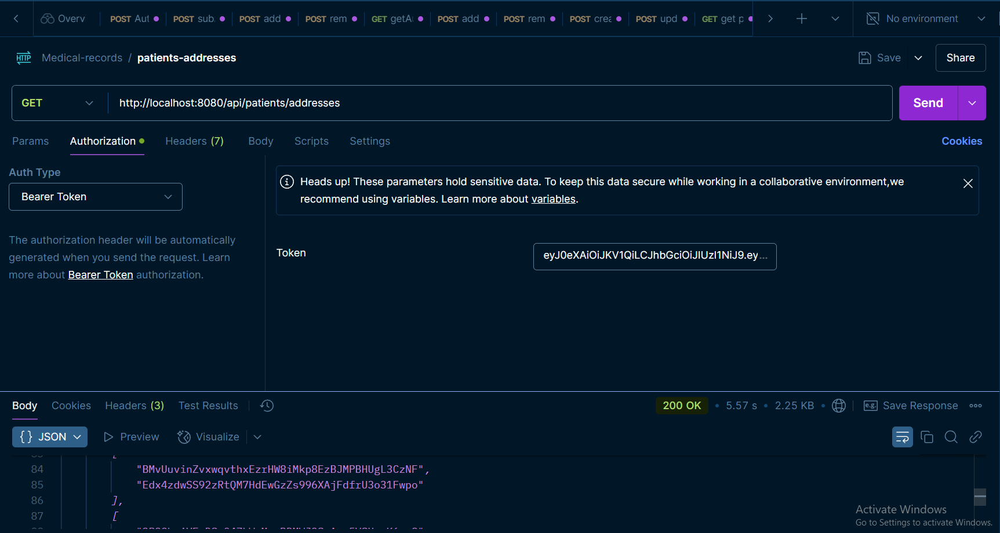

# API Documentation

## Base URL
`http://127.0.0.1:8080/api`

## Authentication
All endpoints except `/auth` require a valid JWT token in the `Authorization` header as `Bearer <token>`. Obtain the token via the `/auth` endpoint.

---

## Transaction Flow
This API uses a two-step process to execute transactions on the Solana blockchain:

1. **Prepare a Transaction**:
   - **Endpoint**: Use one of the `/transactions/prepare/*` endpoints (e.g., `/prepare/create-patient`, `/prepare/add-read-authority`).
   - **Backend Action**: The backend constructs a Solana transaction with a recent blockhash and serializes it as a base64-encoded string (`serialized_transaction`).
   - **Client Action**: 
     - Receive the `serialized_transaction` from the response.
     - Deserialize the base64 string into a Solana transaction object (e.g., using `solana-sdk` in Rust, `@solana/web3.js` in JavaScript, or equivalent libraries).
     - Sign the transaction with the client’s private key (e.g., via a wallet like Phantom, Solana CLI, or programmatically with a keypair).
     - Re-serialize the signed transaction back to base64.

2. **Submit the Transaction**:
   - **Endpoint**: Send the signed `serialized_transaction` to `/transactions/submit`.
   - **Backend Action**: The backend submits the signed transaction to the Solana network and returns the transaction signature.
   - **Client Action**: 
     - Use the returned `signature` to monitor the transaction status on the Solana blockchain (e.g., via Solana Explorer or RPC calls like `getSignatureStatuses`).

---

## Endpoints

### 1. POST /auth
Authenticate a user and generate a JWT token.

- **Method**: `POST`
- **Path**: `/api/auth`
- **Description**: Verifies a user's public key and signature, returning a JWT token for authenticated requests.
- **Headers**: 
  - `Content-Type: application/json`
- **Request Body**:
  ```json
  {
    "public_key": "string",
    "signature": "string",
    "timestamp": integer
  }
  ```
  - `public_key`: Solana public key (base58-encoded).
  - `signature`: Signature of the message `Timestamp: <timestamp>` (base58-encoded).
  - `timestamp`: Unix timestamp in seconds.

- **Example Request**:
  ```bash
  curl -X POST http://127.0.0.1:8080/api/auth \
  -H "Content-Type: application/json" \
  -d '{"public_key": "HtGXcunbPUU54wMa9ZiXdMXvv1b5ppT7DeFLJWdtH7Lr", "signature": "2k3j4k5l6m7n8p9q0r1s2t3u4v5w6x7y8z9a0b1c2d3e4f5g6h7i8j9k0l1m2n3o4p5q6r7s8t9u0v1w2x3y4z5", "timestamp": 1698765432}'
  ```

- **Example Response** (200 OK):
  ```json
  {
    "token": "eyJ0eXAiOiJKV1QiLCJhbGciOiJIUzI1NiJ9.eyJzdWIiOiJIdEdYY3VuYlBVV TU0d01hOVppWGNNWHZ2MWI1cHBUN0RlRk5KV2R0SDdMciIsImV4cCI6MTY5ODc2OTAzMn0.4z5t9u0v1w2x3y4z5a0b1c2d3e4f5g6h7i8j9k0l1m2n",
    "expires_in": 3600,
    "public_key": "HtGXcunbPUU54wMa9ZiXdMXvv1b5ppT7DeFLJWdtH7Lr"
  }
  ```

  

- **Error Response** (401 Unauthorized):
  ```json
  "Unauthorized: Signature verification failed"
  ```

---

### 2. POST /transactions/prepare/add-read-authority
Prepare a transaction to add a read authority.

- **Method**: `POST`
- **Path**: `/api/transactions/prepare/add-read-authority`
- **Description**: Prepares a Solana transaction to add a read authority to the admin account. The client must sign the returned `serialized_transaction` and submit it via `/transactions/submit`.
- **Headers**:
  - `Authorization: Bearer <jwt_token>`
  - `Content-Type: application/json`
- **Request Body**:
  ```json
  {
    "user_pubkey": "string",
    "authority_to_add": "string"
  }
  ```
  - `user_pubkey`: (Optional) Solana public key of the user (base58-encoded). If omitted, derived from JWT.
  - `authority_to_add`: Public key of the new read authority to add (base58-encoded).

- **Example Request**:
  ```bash
  curl -X POST http://127.0.0.1:8080/api/transactions/prepare/add-read-authority \
  -H "Authorization: Bearer <jwt_token>" \
  -H "Content-Type: application/json" \
  -d '{"user_pubkey": "HtGXcunbPUU54wMa9ZiXdMXvv1b5ppT7DeFLJWdtH7Lr", "authority_to_add": "GkHELS6i7BZefYckfmWdxPH6id2rywimHxG1Vf8XBUMq"}'
  ```

- **Example Response** (200 OK):
  ```json
  {
    "serialized_transaction": "base64_encoded_transaction",
    "transaction_type": "add_read_authority",
    "metadata": "{\"user_pubkey\":\"HtGXcunbPUU54wMa9ZiXdMXvv1b5ppT7DeFLJWdtH7Lr\",\"new_authority\":\"GkHELS6i7BZefYckfmWdxPH6id2rywimHxG1Vf8XBUMq\"}"
  }
  ```

  

- **Error Response** (401 Unauthorized):
  ```json
  "Unauthorized: Invalid token"
  ```

- **Client Next Steps**:
  - Deserialize `serialized_transaction`, sign it with the user’s private key, and submit it to `/transactions/submit`.

---

### 3. POST /transactions/prepare/remove-read-authority
Prepare a transaction to remove a read authority.

- **Method**: `POST`
- **Path**: `/api/transactions/prepare/remove-read-authority`
- **Description**: Prepares a Solana transaction to remove a read authority from the admin account. The client must sign the returned `serialized_transaction` and submit it via `/transactions/submit`.
- **Headers**:
  - `Authorization: Bearer <jwt_token>`
  - `Content-Type: application/json`
- **Request Body**:
  ```json
  {
    "user_pubkey": "string",
    "authority_to_remove": "string"
  }
  ```
  - `user_pubkey`: (Optional) Solana public key of the user (base58-encoded). If omitted, derived from JWT.
  - `authority_to_remove`: Public key of the read authority to remove (base58-encoded).

- **Example Request**:
  ```bash
  curl -X POST http://127.0.0.1:8080/api/transactions/prepare/remove-read-authority \
  -H "Authorization: Bearer <jwt_token>" \
  -H "Content-Type: application/json" \
  -d '{"user_pubkey": "HtGXcunbPUU54wMa9ZiXdMXvv1b5ppT7DeFLJWdtH7Lr", "authority_to_remove": "GkHELS6i7BZefYckfmWdxPH6id2rywimHxG1Vf8XBUMq"}'
  ```

- **Example Response** (200 OK):
  ```json
  {
    "serialized_transaction": "base64_encoded_transaction",
    "transaction_type": "remove_read_authority",
    "metadata": "{\"user_pubkey\":\"HtGXcunbPUU54wMa9ZiXdMXvv1b5ppT7DeFLJWdtH7Lr\",\"authority_to_remove\":\"GkHELS6i7BZefYckfmWdxPH6id2rywimHxG1Vf8XBUMq\"}"
  }
  ```

- **Error Response** (401 Unauthorized):
  ```json
  "Unauthorized: Invalid token"
  ```

- **Client Next Steps**:
  - Deserialize `serialized_transaction`, sign it with the user’s private key, and submit it to `/transactions/submit`.

---

### 4. POST /transactions/prepare/add-write-authority
Prepare a transaction to add a write authority.

- **Method**: `POST`
- **Path**: `/api/transactions/prepare/add-write-authority`
- **Description**: Prepares a Solana transaction to add a write authority to the admin account. The client must sign the returned `serialized_transaction` and submit it via `/transactions/submit`.
- **Headers**:
  - `Authorization: Bearer <jwt_token>`
  - `Content-Type: application/json`
- **Request Body**:
  ```json
  {
    "user_pubkey": "string",
    "authority_to_add": "string"
  }
  ```
  - `user_pubkey`: (Optional) Solana public key of the user (base58-encoded). If omitted, derived from JWT.
  - `authority_to_add`: Public key of the new write authority to add (base58-encoded).

- **Example Request**:
  ```bash
  curl -X POST http://127.0.0.1:8080/api/transactions/prepare/add-write-authority \
  -H "Authorization: Bearer <jwt_token>" \
  -H "Content-Type: application/json" \
  -d '{"user_pubkey": "HtGXcunbPUU54wMa9ZiXdMXvv1b5ppT7DeFLJWdtH7Lr", "authority_to_add": "GkHELS6i7BZefYckfmWdxPH6id2rywimHxG1Vf8XBUMq"}'
  ```

- **Example Response** (200 OK):
  ```json
  {
    "serialized_transaction": "base64_encoded_transaction",
    "transaction_type": "add_write_authority",
    "metadata": "{\"user_pubkey\":\"HtGXcunbPUU54wMa9ZiXdMXvv1b5ppT7DeFLJWdtH7Lr\",\"new_authority\":\"GkHELS6i7BZefYckfmWdxPH6id2rywimHxG1Vf8XBUMq\"}"
  }
  ```

- **Error Response** (401 Unauthorized):
  ```json
  "Unauthorized: Invalid token"
  ```

- **Client Next Steps**:
  - Deserialize `serialized_transaction`, sign it with the user’s private key, and submit it to `/transactions/submit`.

---

### 5. POST /transactions/prepare/remove-write-authority
Prepare a transaction to remove a write authority.

- **Method**: `POST`
- **Path**: `/api/transactions/prepare/remove-write-authority`
- **Description**: Prepares a Solana transaction to remove a write authority from the admin account. The client must sign the returned `serialized_transaction` and submit it via `/transactions/submit`.
- **Headers**:
  - `Authorization: Bearer <jwt_token>`
  - `Content-Type: application/json`
- **Request Body**:
  ```json
  {
    "user_pubkey": "string",
    "authority_to_remove": "string"
  }
  ```
  - `user_pubkey`: (Optional) Solana public key of the user (base58-encoded). If omitted, derived from JWT.
  - `authority_to_remove`: Public key of the write authority to remove (base58-encoded).

- **Example Request**:
  ```bash
  curl -X POST http://127.0.0.1:8080/api/transactions/prepare/remove-write-authority \
  -H "Authorization: Bearer <jwt_token>" \
  -H "Content-Type: application/json" \
  -d '{"user_pubkey": "HtGXcunbPUU54wMa9ZiXdMXvv1b5ppT7DeFLJWdtH7Lr", "authority_to_remove": "GkHELS6i7BZefYckfmWdxPH6id2rywimHxG1Vf8XBUMq"}'
  ```

- **Example Response** (200 OK):
  ```json
  {
    "serialized_transaction": "base64_encoded_transaction",
    "transaction_type": "remove_write_authority",
    "metadata": "{\"user_pubkey\":\"HtGXcunbPUU54wMa9ZiXdMXvv1b5ppT7DeFLJWdtH7Lr\",\"authority_to_remove\":\"GkHELS6i7BZefYckfmWdxPH6id2rywimHxG1Vf8XBUMq\"}"
  }
  ```

- **Error Response** (401 Unauthorized):
  ```json
  "Unauthorized: Invalid token"
  ```

- **Client Next Steps**:
  - Deserialize `serialized_transaction`, sign it with the user’s private key, and submit it to `/transactions/submit`.

---

### 6. POST /transactions/prepare/create-patient
Prepare a transaction to create a patient record.

- **Method**: `POST`
- **Path**: `/api/transactions/prepare/create-patient`
- **Description**: Prepares a Solana transaction to create a new patient record with encrypted data. Supports file uploads to Pinata. The client must sign the returned `serialized_transaction` and submit it via `/transactions/submit`.
- **Headers**:
  - `Authorization: Bearer <jwt_token>`
  - `Content-Type: multipart/form-data`
- **Request Body (Form Data)**:
  - `user_pubkey`: (Optional) Solana public key of the user (base58-encoded). If omitted, derived from JWT.
  - `name`: Patient’s name (string).
  - `blood_type`: Patient’s blood type (string, e.g., "O+").
  - `previous_report`: Patient’s previous medical report (string).
  - `ph_no`: Patient’s phone number (string).
  - `file`: (Optional) File to upload (binary data, e.g., PDF or image).

- **Example Request** (With File):
  ```bash
  curl -X POST http://127.0.0.1:8080/api/transactions/prepare/create-patient \
  -H "Authorization: Bearer <jwt_token>" \
  -F "user_pubkey=HtGXcunbPUU54wMa9ZiXdMXvv1b5ppT7DeFLJWdtH7Lr" \
  -F "name=John Doe" \
  -F "blood_type=O+" \
  -F "previous_report=Healthy" \
  -F "ph_no=1234567890" \
  -F "file=@/path/to/report.pdf"
  ```

- **Example Request** (Without File):
  ```bash
  curl -X POST http://127.0.0.1:8080/api/transactions/prepare/create-patient \
  -H "Authorization: Bearer <jwt_token>" \
  -F "name=John Doe" \
  -F "blood_type=O+" \
  -F "previous_report=Healthy" \
  -F "ph_no=1234567890"
  ```

- **Example Response** (200 OK):
  ```json
  {
    "serialized_transaction": "base64_encoded_transaction",
    "transaction_type": "create_patient",
    "encrypted_data_with_seed": "encrypted_data_base64|nonce_base64|patient_seed_pubkey"
  }
  ```

  

- **Error Response** (400 Bad Request):
  ```json
  "Bad Request: Missing required patient data fields"
  ```

- **Error Response** (401 Unauthorized):
  ```json
  "Unauthorized: User pubkey mismatch"
  ```

- **Client Next Steps**:
  - Deserialize `serialized_transaction`, sign it with the user’s private key, and submit it to `/transactions/submit`.
  - Store `encrypted_data_with_seed` if needed for later reference (e.g., to extract `patient_seed_pubkey`).

---

### 7. POST /transactions/prepare/update-patient
Prepare a transaction to update a patient record.

- **Method**: `POST`
- **Path**: `/api/transactions/prepare/update-patient`
- **Description**: Prepares a Solana transaction to update an existing patient record with new encrypted data. Supports file uploads to Pinata. The client must sign the returned `serialized_transaction` and submit it via `/transactions/submit`.
- **Headers**:
  - `Authorization: Bearer <jwt_token>`
  - `Content-Type: multipart/form-data`
- **Request Body (Form Data)**:
  - `user_pubkey`: (Optional) Solana public key of the user (base58-encoded). If omitted, derived from JWT.
  - `patient_seed`: Public key of the patient seed (base58-encoded).
  - `name`: Updated patient’s name (string).
  - `blood_type`: Updated patient’s blood type (string, e.g., "O+").
  - `previous_report`: Updated patient’s previous medical report (string).
  - `ph_no`: Updated patient’s phone number (string).
  - `file`: (Optional) Updated file to upload (binary data, e.g., PDF or image).

- **Example Request** (With File):
  ```bash
  curl -X POST http://127.0.0.1:8080/api/transactions/prepare/update-patient \
  -H "Authorization: Bearer <jwt_token>" \
  -F "user_pubkey=HtGXcunbPUU54wMa9ZiXdMXvv1b5ppT7DeFLJWdtH7Lr" \
  -F "patient_seed=GaoZEZtR62xeRez7WTPHWd4pdDSAHGscgj5pwoHkLgnN" \
  -F "name=John Doe" \
  -F "blood_type=O+" \
  -F "previous_report=Updated Report" \
  -F "ph_no=1234567890" \
  -F "file=@/path/to/updated_report.pdf"
  ```

- **Example Request** (Without File):
  ```bash
  curl -X POST http://127.0.0.1:8080/api/transactions/prepare/update-patient \
  -H "Authorization: Bearer <jwt_token>" \
  -F "patient_seed=GaoZEZtR62xeRez7WTPHWd4pdDSAHGscgj5pwoHkLgnN" \
  -F "name=John Doe" \
  -F "blood_type=O+" \
  -F "previous_report=Updated Report" \
  -F "ph_no=1234567890"
  ```

- **Example Response** (200 OK):
  ```json
  {
    "serialized_transaction": "base64_encoded_transaction",
    "transaction_type": "update_patient",
    "encrypted_data_with_seed": "encrypted_data_base64|nonce_base64|GaoZEZtR62xeRez7WTPHWd4pdDSAHGscgj5pwoHkLgnN"
  }
  ```

- **Error Response** (400 Bad Request):
  ```json
  "Bad Request: No patient_seed provided"
  ```

- **Error Response** (401 Unauthorized):
  ```json
  "Unauthorized: User pubkey mismatch"
  ```

- **Client Next Steps**:
  - Deserialize `serialized_transaction`, sign it with the user’s private key, and submit it to `/transactions/submit`.

---

### 8. POST /transactions/submit
Submit a signed transaction to the Solana network.

- **Method**: `POST`
- **Path**: `/api/transactions/submit`
- **Description**: Submits a signed transaction (prepared via `/transactions/prepare/*` and signed by the client) to the Solana network and returns the transaction signature.
- **Headers**:
  - `Authorization: Bearer <jwt_token>`
  - `Content-Type: application/json`
- **Request Body**:
  ```json
  {
    "serialized_transaction": "string"
  }
  ```
  - `serialized_transaction`: Base64-encoded, signed transaction from a prepare endpoint.

- **Example Request**:
  ```bash
  curl -X POST http://127.0.0.1:8080/api/transactions/submit \
  -H "Authorization: Bearer <jwt_token>" \
  -H "Content-Type: application/json" \
  -d '{"serialized_transaction": "base64_encoded_signed_transaction"}'
  ```

- **Example Response** (200 OK):
  ```json
  {
    "signature": "5Ej9Xj7z9k3j4k5l6m7n8p9q0r1s2t3u4v5w6x7y8z9a0b1c2d3e4f5g6h7i8j9k0l1m2n3o4p5q6r7s8t9u0v1"
  }
  ```

  

- **Error Response** (400 Bad Request):
  ```json
  "Bad Request: Missing signature for required signer: <pubkey>"
  ```

- **Client Next Steps**:
  - Use the `signature` to monitor transaction confirmation (e.g., via Solana Explorer or RPC).

---

### 9. GET /transactions/authorities
Get the list of authorities.

- **Method**: `GET`
- **Path**: `/api/transactions/authorities`
- **Description**: Retrieves the admin authority and lists of read and write authorities from the Solana program.
- **Headers**:
  - `Authorization: Bearer <jwt_token>`
- **Request Body**: None

- **Example Request**:
  ```bash
  curl -X GET http://127.0.0.1:8080/api/transactions/authorities \
  -H "Authorization: Bearer <jwt_token>"
  ```

- **Example Response** (200 OK):
  ```json
  {
    "authority": "HtGXcunbPUU54wMa9ZiXdMXvv1b5ppT7DeFLJWdtH7Lr",
    "read_authorities": ["GaoZEZtR62xeRez7WTPHWd4pdDSAHGscgj5pwoHkLgnN"],
    "write_authorities": ["FaoZEZtR62xeRez7WTPHWd4pdDSAHGscgj5pwoHkLgnM"]
  }
  ```

- **Error Response** (400 Bad Request):
  ```json
  "Bad Request: Admin account not owned by program"
  ```

---

### 10. GET /transactions/authority-history
Get the authority history.

- **Method**: `GET`
- **Path**: `/api/transactions/authority-history`
- **Description**: Retrieves the history of authority changes (additions/removals) from the Solana program.
- **Headers**:
  - `Authorization: Bearer <jwt_token>`
- **Request Body**: None

- **Example Request**:
  ```bash
  curl -X GET http://127.0.0.1:8080/api/transactions/authority-history \
  -H "Authorization: Bearer <jwt_token>"
  ```

- **Example Response** (200 OK):
  ```json
  {
    "entries": [
      {
        "admin": "HtGXcunbPUU54wMa9ZiXdMXvv1b5ppT7DeFLJWdtH7Lr",
        "authority": "GaoZEZtR62xeRez7WTPHWd4pdDSAHGscgj5pwoHkLgnN",
        "added": true,
        "is_read": true,
        "timestamp": 1698765432
      },
      {
        "admin": "HtGXcunbPUU54wMa9ZiXdMXvv1b5ppT7DeFLJWdtH7Lr",
        "authority": "FaoZEZtR62xeRez7WTPHWd4pdDSAHGscgj5pwoHkLgnM",
        "added": false,
        "is_read": false,
        "timestamp": 1698765500
      }
    ]
  }
  ```

  

- **Error Response** (400 Bad Request):
  ```json
  "Bad Request: History account not owned by program"
  ```

---

### 11. GET /patient/{patient_seed}
Get a time-limited URL to view patient data.

- **Method**: `GET`
- **Path**: `/api/patient/{patient_seed}`
- **Description**: Returns a unique, time-limited URL (valid for 1 hour) to access decrypted patient data.
- **Headers**:
  - `Authorization: Bearer <jwt_token>`
- **Path Parameters**:
  - `patient_seed`: Public key of the patient seed (base58-encoded).
- **Request Body**: None

- **Example Request**:
  ```bash
  curl -X GET http://127.0.0.1:8080/api/patient/GaoZEZtR62xeRez7WTPHWd4pdDSAHGscgj5pwoHkLgnN \
  -H "Authorization: Bearer <jwt_token>"
  ```

- **Example Response** (200 OK):
  ```json
  {
    "view_url": "http://localhost:8080/api/view_patient/550e8400-e29b-41d4-a716-446655440000"
  }
  ```

- **Error Response** (400 Bad Request):
  ```json
  "Bad Request: Patient record not initialized"
  ```

- **Error Response** (401 Unauthorized):
  ```json
  "Unauthorized: User does not have read authority"
  ```

---

### 12. GET /view_patient/{token}
View decrypted patient data.

- **Method**: `GET`
- **Path**: `/api/view_patient/{token}`
- **Description**: Returns the decrypted patient data using a time-limited token from `/patient/{patient_seed}`.
- **Headers**:
  - `Authorization: Bearer <jwt_token>`
- **Path Parameters**:
  - `token`: UUID token from the `view_url` (e.g., `550e8400-e29b-41d4-a716-446655440000`).
- **Request Body**: None

- **Example Request**:
  ```bash
  curl -X GET http://127.0.0.1:8080/api/view_patient/550e8400-e29b-41d4-a716-446655440000 \
  -H "Authorization: Bearer <jwt_token>"
  ```

- **Example Response** (200 OK):
  ```json
  {
    "name": "John Doe",
    "blood_type": "O+",
    "previous_report": "Updated Report",
    "ph_no": "1234567890",
    "file": "QmXoypizjW3WknFiJnKLwHCnL72vedxjQkDDP1mXWo6uco"
  }
  ```

  

- **Error Response** (401 Unauthorized):
  ```json
  "Unauthorized: Token expired"
  ```

- **Error Response** (500 Internal Server Error):
  ```json
  "Internal Server Error: Decryption failed: ..."
  ```

---

### 13. GET /patients/addresses
Get all patient addresses and seeds.

- **Method**: `GET`
- **Path**: `/api/patients/addresses`
- **Description**: Retrieves a list of all patient PDAs and their associated seeds from the Solana program.
- **Headers**:
  - `Authorization: Bearer <jwt_token>`
- **Request Body**: None

- **Example Request**:
  ```bash
  curl -X GET http://127.0.0.1:8080/api/patients/addresses \
  -H "Authorization: Bearer <jwt_token>"
  ```

- **Example Response** (200 OK):
  ```json
  {
    "patient_addresses": [
      ["66DodqE3a344J6QQw4wzXxcsPRwP9ocuPzPzaLbMTPD3", "GaoZEZtR62xeRez7WTPHWd4pdDSAHGscgj5pwoHkLgnN"],
      ["7xKzLqP9mR2vN3tW5uY6iJ8oK9pQ0rT1sU2vW3xY4z5", "FaoZEZtR62xeRez7WTPHWd4pdDSAHGscgj5pwoHkLgnM"]
    ]
  }
  ```

  

- **Error Response** (401 Unauthorized):
  ```json
  "Unauthorized: Invalid token"
  ```

---

## Error Codes
- **200 OK**: Request succeeded.
- **400 Bad Request**: Invalid input or data not found.
- **401 Unauthorized**: Invalid or expired token/signature.
- **500 Internal Server Error**: Server-side error (e.g., encryption/decryption failure).

## Notes
- Replace `<jwt_token>` with the token obtained from `/auth`.
- The `serialized_transaction` in responses is a base64-encoded string that needs to be signed by the client and submitted via `/transactions/submit`.
- The `/view_patient/{token}` endpoint is valid for 1 hour from the time the URL is generated.
- For `create-patient` and `update-patient`, use `multipart/form-data` instead of JSON due to file upload support. Tools like Postman or curl with `-F` flags are recommended for testing.
- The `file` field in responses contains a Pinata CID (e.g., `QmXoypizjW3WknFiJnKLwHCnL72vedxjQkDDP1mXWo6uco`) if a file was uploaded.

---

### Placement of Images
The images are added to the following endpoints after their **Example Response** sections:
1. **POST /auth**: `screenshots/auth.png`
2. **POST /transactions/prepare/add-read-authority**: `screenshots/add-read-authority.png`
3. **POST /transactions/prepare/create-patient**: `screenshots/create-patient.png`
4. **POST /transactions/submit**: `screenshots/submit-transaction.png`
5. **GET /transactions/authority-history**: `screenshots/authority-history.png`
6. **GET /view_patient/{token}**: `screenshots/view-patient.png`
7. **GET /patients/addresses**: `screenshots/patient-addresses.png`

I didn’t add images for the `remove-read-authority`, `add-write-authority`, `remove-write-authority`, `/transactions/authorities`, or `/patient/{patient_seed}` endpoints since no corresponding screenshots were provided for them.

### Updated README.md
Assuming your `README.md` at `D:\SoluLabs\medical-record-solana\README.md` currently contains just the API documentation (or is empty), here’s the full content with the images included. If your `README.md` has additional sections (e.g., project setup instructions), let me know, and I’ll integrate this into that structure.

```markdown
# API Documentation

## Base URL
`http://127.0.0.1:8080/api`

## Authentication
All endpoints except `/auth` require a valid JWT token in the `Authorization` header as `Bearer <token>`. Obtain the token via the `/auth` endpoint.

---

## Transaction Flow
This API uses a two-step process to execute transactions on the Solana blockchain:

1. **Prepare a Transaction**:
   - **Endpoint**: Use one of the `/transactions/prepare/*` endpoints (e.g., `/prepare/create-patient`, `/prepare/add-read-authority`).
   - **Backend Action**: The backend constructs a Solana transaction with a recent blockhash and serializes it as a base64-encoded string (`serialized_transaction`).
   - **Client Action**: 
     - Receive the `serialized_transaction` from the response.
     - Deserialize the base64 string into a Solana transaction object (e.g., using `solana-sdk` in Rust, `@solana/web3.js` in JavaScript, or equivalent libraries).
     - Sign the transaction with the client’s private key (e.g., via a wallet like Phantom, Solana CLI, or programmatically with a keypair).
     - Re-serialize the signed transaction back to base64.

2. **Submit the Transaction**:
   - **Endpoint**: Send the signed `serialized_transaction` to `/transactions/submit`.
   - **Backend Action**: The backend submits the signed transaction to the Solana network and returns the transaction signature.
   - **Client Action**: 
     - Use the returned `signature` to monitor the transaction status on the Solana blockchain (e.g., via Solana Explorer or RPC calls like `getSignatureStatuses`).

---

## Endpoints

### 1. POST /auth
Authenticate a user and generate a JWT token.

- **Method**: `POST`
- **Path**: `/api/auth`
- **Description**: Verifies a user's public key and signature, returning a JWT token for authenticated requests.
- **Headers**: 
  - `Content-Type: application/json`
- **Request Body**:
  ```json
  {
    "public_key": "string",
    "signature": "string",
    "timestamp": integer
  }
  ```
  - `public_key`: Solana public key (base58-encoded).
  - `signature`: Signature of the message `Timestamp: <timestamp>` (base58-encoded).
  - `timestamp`: Unix timestamp in seconds.

- **Example Request**:
  ```bash
  curl -X POST http://127.0.0.1:8080/api/auth \
  -H "Content-Type: application/json" \
  -d '{"public_key": "HtGXcunbPUU54wMa9ZiXdMXvv1b5ppT7DeFLJWdtH7Lr", "signature": "2k3j4k5l6m7n8p9q0r1s2t3u4v5w6x7y8z9a0b1c2d3e4f5g6h7i8j9k0l1m2n3o4p5q6r7s8t9u0v1w2x3y4z5", "timestamp": 1698765432}'
  ```

- **Example Response** (200 OK):
  ```json
  {
    "token": "eyJ0eXAiOiJKV1QiLCJhbGciOiJIUzI1NiJ9.eyJzdWIiOiJIdEdYY3VuYlBVV TU0d01hOVppWGNNWHZ2MWI1cHBUN0RlRk5KV2R0SDdMciIsImV4cCI6MTY5ODc2OTAzMn0.4z5t9u0v1w2x3y4z5a0b1c2d3e4f5g6h7i8j9k0l1m2n",
    "expires_in": 3600,
    "public_key": "HtGXcunbPUU54wMa9ZiXdMXvv1b5ppT7DeFLJWdtH7Lr"
  }
  ```

  

- **Error Response** (401 Unauthorized):
  ```json
  "Unauthorized: Signature verification failed"
  ```

---

### 2. POST /transactions/prepare/add-read-authority
Prepare a transaction to add a read authority.

- **Method**: `POST`
- **Path**: `/api/transactions/prepare/add-read-authority`
- **Description**: Prepares a Solana transaction to add a read authority to the admin account. The client must sign the returned `serialized_transaction` and submit it via `/transactions/submit`.
- **Headers**:
  - `Authorization: Bearer <jwt_token>`
  - `Content-Type: application/json`
- **Request Body**:
  ```json
  {
    "user_pubkey": "string",
    "authority_to_add": "string"
  }
  ```
  - `user_pubkey`: (Optional) Solana public key of the user (base58-encoded). If omitted, derived from JWT.
  - `authority_to_add`: Public key of the new read authority to add (base58-encoded).

- **Example Request**:
  ```bash
  curl -X POST http://127.0.0.1:8080/api/transactions/prepare/add-read-authority \
  -H "Authorization: Bearer <jwt_token>" \
  -H "Content-Type: application/json" \
  -d '{"user_pubkey": "HtGXcunbPUU54wMa9ZiXdMXvv1b5ppT7DeFLJWdtH7Lr", "authority_to_add": "GkHELS6i7BZefYckfmWdxPH6id2rywimHxG1Vf8XBUMq"}'
  ```

- **Example Response** (200 OK):
  ```json
  {
    "serialized_transaction": "base64_encoded_transaction",
    "transaction_type": "add_read_authority",
    "metadata": "{\"user_pubkey\":\"HtGXcunbPUU54wMa9ZiXdMXvv1b5ppT7DeFLJWdtH7Lr\",\"new_authority\":\"GkHELS6i7BZefYckfmWdxPH6id2rywimHxG1Vf8XBUMq\"}"
  }
  ```

  

- **Error Response** (401 Unauthorized):
  ```json
  "Unauthorized: Invalid token"
  ```

- **Client Next Steps**:
  - Deserialize `serialized_transaction`, sign it with the user’s private key, and submit it to `/transactions/submit`.

---

### 3. POST /transactions/prepare/remove-read-authority
Prepare a transaction to remove a read authority.

- **Method**: `POST`
- **Path**: `/api/transactions/prepare/remove-read-authority`
- **Description**: Prepares a Solana transaction to remove a read authority from the admin account. The client must sign the returned `serialized_transaction` and submit it via `/transactions/submit`.
- **Headers**:
  - `Authorization: Bearer <jwt_token>`
  - `Content-Type: application/json`
- **Request Body**:
  ```json
  {
    "user_pubkey": "string",
    "authority_to_remove": "string"
  }
  ```
  - `user_pubkey`: (Optional) Solana public key of the user (base58-encoded). If omitted, derived from JWT.
  - `authority_to_remove`: Public key of the read authority to remove (base58-encoded).

- **Example Request**:
  ```bash
  curl -X POST http://127.0.0.1:8080/api/transactions/prepare/remove-read-authority \
  -H "Authorization: Bearer <jwt_token>" \
  -H "Content-Type: application/json" \
  -d '{"user_pubkey": "HtGXcunbPUU54wMa9ZiXdMXvv1b5ppT7DeFLJWdtH7Lr", "authority_to_remove": "GkHELS6i7BZefYckfmWdxPH6id2rywimHxG1Vf8XBUMq"}'
  ```

- **Example Response** (200 OK):
  ```json
  {
    "serialized_transaction": "base64_encoded_transaction",
    "transaction_type": "remove_read_authority",
    "metadata": "{\"user_pubkey\":\"HtGXcunbPUU54wMa9ZiXdMXvv1b5ppT7DeFLJWdtH7Lr\",\"authority_to_remove\":\"GkHELS6i7BZefYckfmWdxPH6id2rywimHxG1Vf8XBUMq\"}"
  }
  ```

- **Error Response** (401 Unauthorized):
  ```json
  "Unauthorized: Invalid token"
  ```

- **Client Next Steps**:
  - Deserialize `serialized_transaction`, sign it with the user’s private key, and submit it to `/transactions/submit`.

---

### 4. POST /transactions/prepare/add-write-authority
Prepare a transaction to add a write authority.

- **Method**: `POST`
- **Path**: `/api/transactions/prepare/add-write-authority`
- **Description**: Prepares a Solana transaction to add a write authority to the admin account. The client must sign the returned `serialized_transaction` and submit it via `/transactions/submit`.
- **Headers**:
  - `Authorization: Bearer <jwt_token>`
  - `Content-Type: application/json`
- **Request Body**:
  ```json
  {
    "user_pubkey": "string",
    "authority_to_add": "string"
  }
  ```
  - `user_pubkey`: (Optional) Solana public key of the user (base58-encoded). If omitted, derived from JWT.
  - `authority_to_add`: Public key of the new write authority to add (base58-encoded).

- **Example Request**:
  ```bash
  curl -X POST http://127.0.0.1:8080/api/transactions/prepare/add-write-authority \
  -H "Authorization: Bearer <jwt_token>" \
  -H "Content-Type: application/json" \
  -d '{"user_pubkey": "HtGXcunbPUU54wMa9ZiXdMXvv1b5ppT7DeFLJWdtH7Lr", "authority_to_add": "GkHELS6i7BZefYckfmWdxPH6id2rywimHxG1Vf8XBUMq"}'
  ```

- **Example Response** (200 OK):
  ```json
  {
    "serialized_transaction": "base64_encoded_transaction",
    "transaction_type": "add_write_authority",
    "metadata": "{\"user_pubkey\":\"HtGXcunbPUU54wMa9ZiXdMXvv1b5ppT7DeFLJWdtH7Lr\",\"new_authority\":\"GkHELS6i7BZefYckfmWdxPH6id2rywimHxG1Vf8XBUMq\"}"
  }
  ```

- **Error Response** (401 Unauthorized):
  ```json
  "Unauthorized: Invalid token"
  ```

- **Client Next Steps**:
  - Deserialize `serialized_transaction`, sign it with the user’s private key, and submit it to `/transactions/submit`.

---

### 5. POST /transactions/prepare/remove-write-authority
Prepare a transaction to remove a write authority.

- **Method**: `POST`
- **Path**: `/api/transactions/prepare/remove-write-authority`
- **Description**: Prepares a Solana transaction to remove a write authority from the admin account. The client must sign the returned `serialized_transaction` and submit it via `/transactions/submit`.
- **Headers**:
  - `Authorization: Bearer <jwt_token>`
  - `Content-Type: application/json`
- **Request Body**:
  ```json
  {
    "user_pubkey": "string",
    "authority_to_remove": "string"
  }
  ```
  - `user_pubkey`: (Optional) Solana public key of the user (base58-encoded). If omitted, derived from JWT.
  - `authority_to_remove`: Public key of the write authority to remove (base58-encoded).

- **Example Request**:
  ```bash
  curl -X POST http://127.0.0.1:8080/api/transactions/prepare/remove-write-authority \
  -H "Authorization: Bearer <jwt_token>" \
  -H "Content-Type: application/json" \
  -d '{"user_pubkey": "HtGXcunbPUU54wMa9ZiXdMXvv1b5ppT7DeFLJWdtH7Lr", "authority_to_remove": "GkHELS6i7BZefYckfmWdxPH6id2rywimHxG1Vf8XBUMq"}'
  ```

- **Example Response** (200 OK):
  ```json
  {
    "serialized_transaction": "base64_encoded_transaction",
    "transaction_type": "remove_write_authority",
    "metadata": "{\"user_pubkey\":\"HtGXcunbPUU54wMa9ZiXdMXvv1b5ppT7DeFLJWdtH7Lr\",\"authority_to_remove\":\"GkHELS6i7BZefYckfmWdxPH6id2rywimHxG1Vf8XBUMq\"}"
  }
  ```

- **Error Response** (401 Unauthorized):
  ```json
  "Unauthorized: Invalid token"
  ```

- **Client Next Steps**:
  - Deserialize `serialized_transaction`, sign it with the user’s private key, and submit it to `/transactions/submit`.

---

### 6. POST /transactions/prepare/create-patient
Prepare a transaction to create a patient record.

- **Method**: `POST`
- **Path**: `/api/transactions/prepare/create-patient`
- **Description**: Prepares a Solana transaction to create a new patient record with encrypted data. Supports file uploads to Pinata. The client must sign the returned `serialized_transaction` and submit it via `/transactions/submit`.
- **Headers**:
  - `Authorization: Bearer <jwt_token>`
  - `Content-Type: multipart/form-data`
- **Request Body (Form Data)**:
  - `user_pubkey`: (Optional) Solana public key of the user (base58-encoded). If omitted, derived from JWT.
  - `name`: Patient’s name (string).
  - `blood_type`: Patient’s blood type (string, e.g., "O+").
  - `previous_report`: Patient’s previous medical report (string).
  - `ph_no`: Patient’s phone number (string).
  - `file`: (Optional) File to upload (binary data, e.g., PDF or image).

- **Example Request** (With File):
  ```bash
  curl -X POST http://127.0.0.1:8080/api/transactions/prepare/create-patient \
  -H "Authorization: Bearer <jwt_token>" \
  -F "user_pubkey=HtGXcunbPUU54wMa9ZiXdMXvv1b5ppT7DeFLJWdtH7Lr" \
  -F "name=John Doe" \
  -F "blood_type=O+" \
  -F "previous_report=Healthy" \
  -F "ph_no=1234567890" \
  -F "file=@/path/to/report.pdf"
  ```

- **Example Request** (Without File):
  ```bash
  curl -X POST http://127.0.0.1:8080/api/transactions/prepare/create-patient \
  -H "Authorization: Bearer <jwt_token>" \
  -F "name=John Doe" \
  -F "blood_type=O+" \
  -F "previous_report=Healthy" \
  -F "ph_no=1234567890"
  ```

- **Example Response** (200 OK):
  ```json
  {
    "serialized_transaction": "base64_encoded_transaction",
    "transaction_type": "create_patient",
    "encrypted_data_with_seed": "encrypted_data_base64|nonce_base64|patient_seed_pubkey"
  }
  ```

  

- **Error Response** (400 Bad Request):
  ```json
  "Bad Request: Missing required patient data fields"
  ```

- **Error Response** (401 Unauthorized):
  ```json
  "Unauthorized: User pubkey mismatch"
  ```

- **Client Next Steps**:
  - Deserialize `serialized_transaction`, sign it with the user’s private key, and submit it to `/transactions/submit`.
  - Store `encrypted_data_with_seed` if needed for later reference (e.g., to extract `patient_seed_pubkey`).

---

### 7. POST /transactions/prepare/update-patient
Prepare a transaction to update a patient record.

- **Method**: `POST`
- **Path**: `/api/transactions/prepare/update-patient`
- **Description**: Prepares a Solana transaction to update an existing patient record with new encrypted data. Supports file uploads to Pinata. The client must sign the returned `serialized_transaction` and submit it via `/transactions/submit`.
- **Headers**:
  - `Authorization: Bearer <jwt_token>`
  - `Content-Type: multipart/form-data`
- **Request Body (Form Data)**:
  - `user_pubkey`: (Optional) Solana public key of the user (base58-encoded). If omitted, derived from JWT.
  - `patient_seed`: Public key of the patient seed (base58-encoded).
  - `name`: Updated patient’s name (string).
  - `blood_type`: Updated patient’s blood type (string, e.g., "O+").
  - `previous_report`: Updated patient’s previous medical report (string).
  - `ph_no`: Updated patient’s phone number (string).
  - `file`: (Optional) Updated file to upload (binary data, e.g., PDF or image).

- **Example Request** (With File):
  ```bash
  curl -X POST http://127.0.0.1:8080/api/transactions/prepare/update-patient \
  -H "Authorization: Bearer <jwt_token>" \
  -F "user_pubkey=HtGXcunbPUU54wMa9ZiXdMXvv1b5ppT7DeFLJWdtH7Lr" \
  -F "patient_seed=GaoZEZtR62xeRez7WTPHWd4pdDSAHGscgj5pwoHkLgnN" \
  -F "name=John Doe" \
  -F "blood_type=O+" \
  -F "previous_report=Updated Report" \
  -F "ph_no=1234567890" \
  -F "file=@/path/to/updated_report.pdf"
  ```

- **Example Request** (Without File):
  ```bash
  curl -X POST http://127.0.0.1:8080/api/transactions/prepare/update-patient \
  -H "Authorization: Bearer <jwt_token>" \
  -F "patient_seed=GaoZEZtR62xeRez7WTPHWd4pdDSAHGscgj5pwoHkLgnN" \
  -F "name=John Doe" \
  -F "blood_type=O+" \
  -F "previous_report=Updated Report" \
  -F "ph_no=1234567890"
  ```

- **Example Response** (200 OK):
  ```json
  {
    "serialized_transaction": "base64_encoded_transaction",
    "transaction_type": "update_patient",
    "encrypted_data_with_seed": "encrypted_data_base64|nonce_base64|GaoZEZtR62xeRez7WTPHWd4pdDSAHGscgj5pwoHkLgnN"
  }
  ```

- **Error Response** (400 Bad Request):
  ```json
  "Bad Request: No patient_seed provided"
  ```

- **Error Response** (401 Unauthorized):
  ```json
  "Unauthorized: User pubkey mismatch"
  ```

- **Client Next Steps**:
  - Deserialize `serialized_transaction`, sign it with the user’s private key, and submit it to `/transactions/submit`.

---

### 8. POST /transactions/submit
Submit a signed transaction to the Solana network.

- **Method**: `POST`
- **Path**: `/api/transactions/submit`
- **Description**: Submits a signed transaction (prepared via `/transactions/prepare/*` and signed by the client) to the Solana network and returns the transaction signature.
- **Headers**:
  - `Authorization: Bearer <jwt_token>`
  - `Content-Type: application/json`
- **Request Body**:
  ```json
  {
    "serialized_transaction": "string"
  }
  ```
  - `serialized_transaction`: Base64-encoded, signed transaction from a prepare endpoint.

- **Example Request**:
  ```bash
  curl -X POST http://127.0.0.1:8080/api/transactions/submit \
  -H "Authorization: Bearer <jwt_token>" \
  -H "Content-Type: application/json" \
  -d '{"serialized_transaction": "base64_encoded_signed_transaction"}'
  ```

- **Example Response** (200 OK):
  ```json
  {
    "signature": "5Ej9Xj7z9k3j4k5l6m7n8p9q0r1s2t3u4v5w6x7y8z9a0b1c2d3e4f5g6h7i8j9k0l1m2n3o4p5q6r7s8t9u0v1"
  }
  ```

  

- **Error Response** (400 Bad Request):
  ```json
  "Bad Request: Missing signature for required signer: <pubkey>"
  ```

- **Client Next Steps**:
  - Use the `signature` to monitor transaction confirmation (e.g., via Solana Explorer or RPC).

---

### 9. GET /transactions/authorities
Get the list of authorities.

- **Method**: `GET`
- **Path**: `/api/transactions/authorities`
- **Description**: Retrieves the admin authority and lists of read and write authorities from the Solana program.
- **Headers**:
  - `Authorization: Bearer <jwt_token>`
- **Request Body**: None

- **Example Request**:
  ```bash
  curl -X GET http://127.0.0.1:8080/api/transactions/authorities \
  -H "Authorization: Bearer <jwt_token>"
  ```

- **Example Response** (200 OK):
  ```json
  {
    "authority": "HtGXcunbPUU54wMa9ZiXdMXvv1b5ppT7DeFLJWdtH7Lr",
    "read_authorities": ["GaoZEZtR62xeRez7WTPHWd4pdDSAHGscgj5pwoHkLgnN"],
    "write_authorities": ["FaoZEZtR62xeRez7WTPHWd4pdDSAHGscgj5pwoHkLgnM"]
  }
  ```

- **Error Response** (400 Bad Request):
  ```json
  "Bad Request: Admin account not owned by program"
  ```

---

### 10. GET /transactions/authority-history
Get the authority history.

- **Method**: `GET`
- **Path**: `/api/transactions/authority-history`
- **Description**: Retrieves the history of authority changes (additions/removals) from the Solana program.
- **Headers**:
  - `Authorization: Bearer <jwt_token>`
- **Request Body**: None

- **Example Request**:
  ```bash
  curl -X GET http://127.0.0.1:8080/api/transactions/authority-history \
  -H "Authorization: Bearer <jwt_token>"
  ```

- **Example Response** (200 OK):
  ```json
  {
    "entries": [
      {
        "admin": "HtGXcunbPUU54wMa9ZiXdMXvv1b5ppT7DeFLJWdtH7Lr",
        "authority": "GaoZEZtR62xeRez7WTPHWd4pdDSAHGscgj5pwoHkLgnN",
        "added": true,
        "is_read": true,
        "timestamp": 1698765432
      },
      {
        "admin": "HtGXcunbPUU54wMa9ZiXdMXvv1b5ppT7DeFLJWdtH7Lr",
        "authority": "FaoZEZtR62xeRez7WTPHWd4pdDSAHGscgj5pwoHkLgnM",
        "added": false,
        "is_read": false,
        "timestamp": 1698765500
      }
    ]
  }
  ```

  

- **Error Response** (400 Bad Request):
  ```json
  "Bad Request: History account not owned by program"
  ```

---

### 11. GET /patient/{patient_seed}
Get a time-limited URL to view patient data.

- **Method**: `GET`
- **Path**: `/api/patient/{patient_seed}`
- **Description**: Returns a unique, time-limited URL (valid for 1 hour) to access decrypted patient data.
- **Headers**:
  - `Authorization: Bearer <jwt_token>`
- **Path Parameters**:
  - `patient_seed`: Public key of the patient seed (base58-encoded).
- **Request Body**: None

- **Example Request**:
  ```bash
  curl -X GET http://127.0.0.1:8080/api/patient/GaoZEZtR62xeRez7WTPHWd4pdDSAHGscgj5pwoHkLgnN \
  -H "Authorization: Bearer <jwt_token>"
  ```

- **Example Response** (200 OK):
  ```json
  {
    "view_url": "http://localhost:8080/api/view_patient/550e8400-e29b-41d4-a716-446655440000"
  }
  ```

- **Error Response** (400 Bad Request):
  ```json
  "Bad Request: Patient record not initialized"
  ```

- **Error Response** (401 Unauthorized):
  ```json
  "Unauthorized: User does not have read authority"
  ```

---

### 12. GET /view_patient/{token}
View decrypted patient data.

- **Method**: `GET`
- **Path**: `/api/view_patient/{token}`
- **Description**: Returns the decrypted patient data using a time-limited token from `/patient/{patient_seed}`.
- **Headers**:
  - `Authorization: Bearer <jwt_token>`
- **Path Parameters**:
  - `token`: UUID token from the `view_url` (e.g., `550e8400-e29b-41d4-a716-446655440000`).
- **Request Body**: None

- **Example Request**:
  ```bash
  curl -X GET http://127.0.0.1:8080/api/view_patient/550e8400-e29b-41d4-a716-446655440000 \
  -H "Authorization: Bearer <jwt_token>"
  ```

- **Example Response** (200 OK):
  ```json
  {
    "name": "John Doe",
    "blood_type": "O+",
    "previous_report": "Updated Report",
    "ph_no": "1234567890",
    "file": "QmXoypizjW3WknFiJnKLwHCnL72vedxjQkDDP1mXWo6uco"
  }
  ```

  

- **Error Response** (401 Unauthorized):
  ```json
  "Unauthorized: Token expired"
  ```

- **Error Response** (500 Internal Server Error):
  ```json
  "Internal Server Error: Decryption failed: ..."
  ```

---

### 13. GET /patients/addresses
Get all patient addresses and seeds.

- **Method**: `GET`
- **Path**: `/api/patients/addresses`
- **Description**: Retrieves a list of all patient PDAs and their associated seeds from the Solana program.
- **Headers**:
  - `Authorization: Bearer <jwt_token>`
- **Request Body**: None

- **Example Request**:
  ```bash
  curl -X GET http://127.0.0.1:8080/api/patients/addresses \
  -H "Authorization: Bearer <jwt_token>"
  ```

- **Example Response** (200 OK):
  ```json
  {
    "patient_addresses": [
      ["66DodqE3a344J6QQw4wzXxcsPRwP9ocuPzPzaLbMTPD3", "GaoZEZtR62xeRez7WTPHWd4pdDSAHGscgj5pwoHkLgnN"],
      ["7xKzLqP9mR2vN3tW5uY6iJ8oK9pQ0rT1sU2vW3xY4z5", "FaoZEZtR62xeRez7WTPHWd4pdDSAHGscgj5pwoHkLgnM"]
    ]
  }
  ```

  

- **Error Response** (401 Unauthorized):
  ```json
  "Unauthorized: Invalid token"
  ```

---

## Error Codes
- **200 OK**: Request succeeded.
- **400 Bad Request**: Invalid input or data not found.
- **401 Unauthorized**: Invalid or expired token/signature.
- **500 Internal Server Error**: Server-side error (e.g., encryption/decryption failure).

## Notes
- Replace `<jwt_token>` with the token obtained from `/auth`.
- The `serialized_transaction` in responses is a base64-encoded string that needs to be signed by the client and submitted via `/transactions/submit`.
- The `/view_patient/{token}` endpoint is valid for 1 hour from the time the URL is generated.
- For `create-patient` and `update-patient`, use `multipart/form-data` instead of JSON due to file upload support. Tools like Postman or curl with `-F` flags are recommended for testing.
- The `file` field in responses contains a Pinata CID (e.g., `QmXoypizjW3WknFiJnKLwHCnL72vedxjQkDDP1mXWo6uco`) if a file was uploaded.
```

 